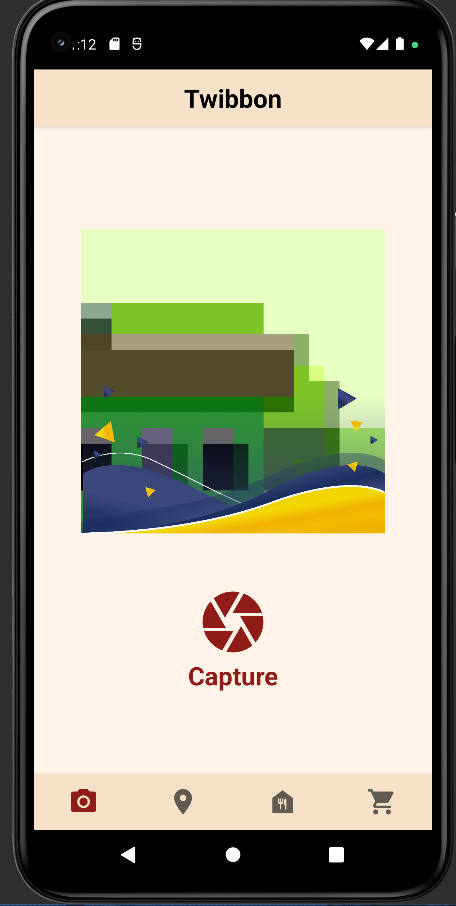
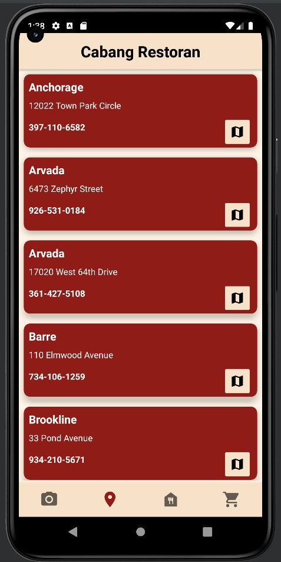
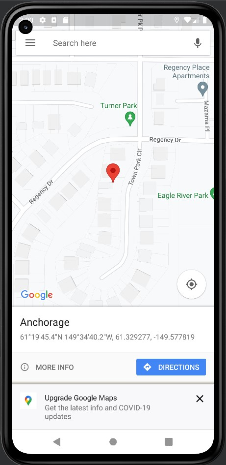
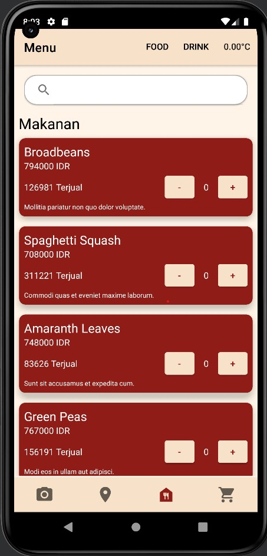
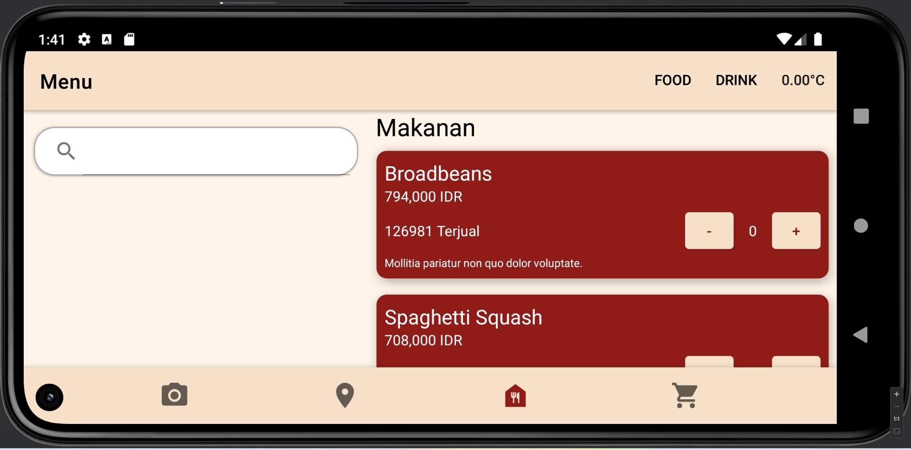
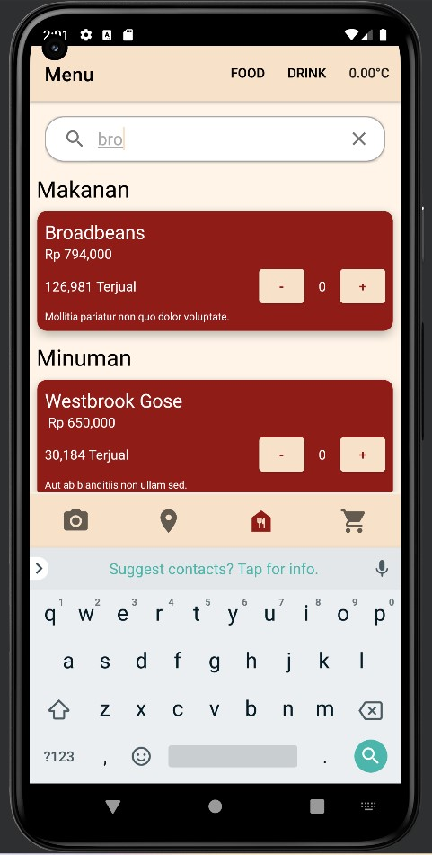
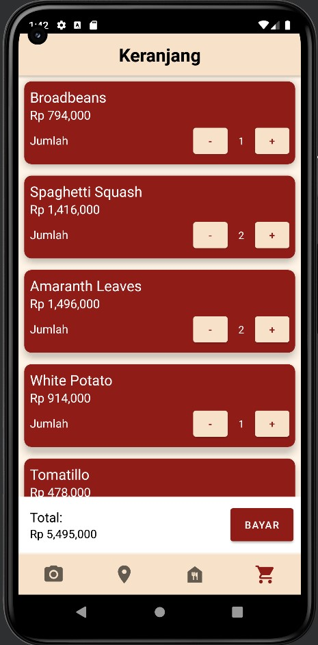

# Tugas Besar 1 - IF3210 Pengembangan Aplikasi pada Platform Khusus

## Deskripsi Aplikasi ANDROID CAN

Aplikasi yang dikembangkan dalam Android ini memiliki nama **Mujika**. Aplikasi ini memiliki beberapa fitur. Fitur pertama adalah twibbon, mengambil foto dari kamera dan secara otomatis memasang twibon ke foto tersebut. Fitur lain adalah lokasi cabang, ditunjukkan cabang beserta lokasinya dengasn menggunakan google map. Fitur lainnya adalah menu, kita bisa memesan makanan atau minuman serta membayarnya menggunakan scan QR. Fitur lain yang berhubungan adalah keranjang, pesanan dari makanan dan/atau minuman akan disimpan di keranjang sebelum dibayar.

## Library yang Digunakan

    androidx.core:core-ktx:1.9.0
    androidx.appcompat:appcompat:1.6.1
    com.google.android.material:material:1.8.0
    androidx.constraintlayout:constraintlayout:2.1.4
    androidx.core:core-ktx:1.9.0
    androidx.camera:camera-view:1.1.0-beta02
    androidTest androidx.test.espresso:espresso-core:3.5.1
    androidx.camera:camera-camera2:1.2.1
    androidx.camera:camera-lifecycle:1.2.1
    androidx.camera:camera-view:1.2.1
    com.squareup.retrofit2:retrofit:2.9.0
    com.squareup.retrofit2:converter-gson:2.9.0
    com.github.yuriy-budiyev:code-scanner:2.3.2
    androidx.room:room-ktx:$2.5.0
    androidx.room:room-runtime:$2.5.0
    androidx.lifecycle:lifecycle-viewmodel-ktx:2.5.1
    androidx.lifecycle:lifecycle-runtime-ktx:2.5.1

## Foto Screenshot Aplikasi

{height=300}
Twibbon beserta Navbar dan Header

{height=300}
Halaman Cabang Restoran

{height=300}
Redirection ke Google Map

{height=300}
Halaman Menu Potrait

{height=300}
Halaman Menu Landscape

{height=300}
Searching di Menu

{height=300}
Halaman Keranjang

## Pembagian Tugas

| NIM      | NAMA                | TASK                                                 | Total Jam                             |
| -------- | ------------------- | ---------------------------------------------------- | ------------------------------------- |
| 13520005 | Christine Hutabarat | Pembayaran, Halaman Cabang Restoran, Manage Fragment | 9 jam persiapan + 45 jam pengerjaan   |
| 13520097 | Angelica Winasta S  | Database, Halaman Keranjang, Halaman Menu            | 9 jam persiapan + 45 jam pengerjaan   |
| 13520121 | Nicholas Budiono    | Halaman Twibbon, Navbar, Navigation Bar              | 15 jam persiapan + 35 jam pengerjaan  |
